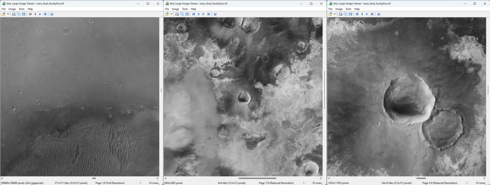
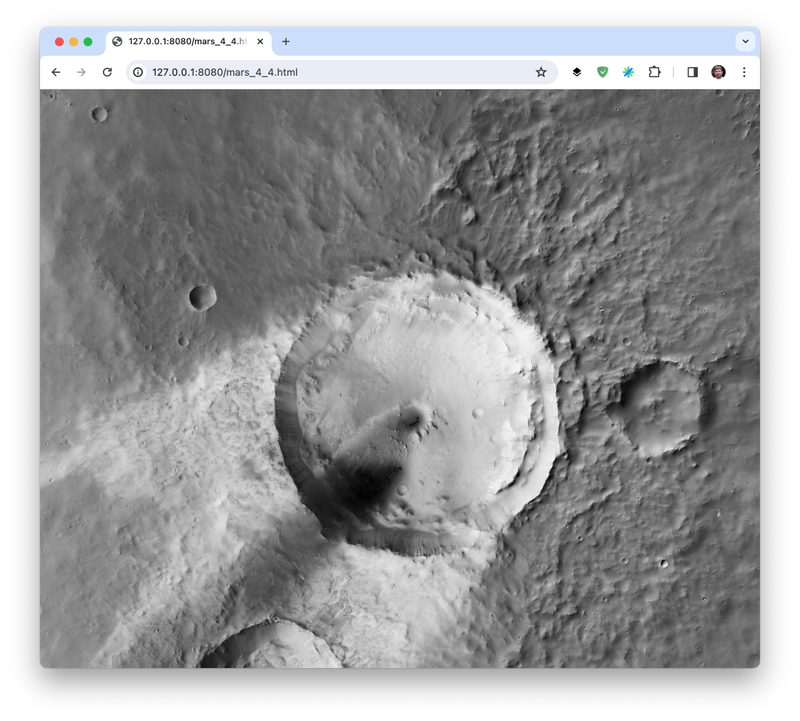

This project is a guide for creating a **single TIFF file** (**42678000 x 2086480 pixels**, that's a lot, at 8.9 terapixels) image of Mars surface.

It is incredibly easy thanks to custom code.

The final TIFF image weights about 1 Terabyte, JPEG compressed (much more if Deflate is used), includes pre-computed sublevels and is tiled to allow even modest computers
to be able to view (zoom, unzoom, pan).

This specially crafted pyramidal tiled TIFF can be opened with my Open Source software for Windows https://github.com/delhoume/vliv .
It can be visualized locally with a browser thanks to the OpenSeaDragon project :
https://openseadragon.github.io/ and my dedicated tile server **khufu** https://github.com/delhoume/khufu 

The source for the data is https://murray-lab.caltech.edu/CTX/index.html

Data is available as one file for a part of the surface that covers 4 square degree, a ZIP file containing geo localization, general information and data.
There are 90 x 44 of them for a total of **3960** files.
We will only use the TIFF that holds pixel data (greyscale 1 byte per pixel), is **47420x47420 pixels** and uncompressed.
A single pixel covers about 5 square meters.

They are available at https://murray-lab.caltech.edu/CTX/V01/tiles/ 

## Step 1 Downloading the source data
  
The first step towards the final image is to download the 3960 zip files.
This requires about 8 terabytes of disk space, I bought a 12To WD MyBook to store them.

I use a 2020 Mac Mini M1, but source code and scripts can be easily adapted or compiled for Windows and Linux.

```scripts/download_all.sh``` will download all, thanks to their HTTP server supporting ```Accept-Ranges```.
You can stop at any moment and downloading will resume when you relaunch it.
The download is split in 4 parts because I did not find how to create a single cUrl command for the files pattern.

Files are named using longitudes from -180 to 176  and latitudes from -88 to 84 in 4 increment

```
>curl -C -   "https://murray-lab.caltech.edu/CTX/V01/tiles/MurrayLab_GlobalCTXMosaic_V01_E[000-176:4]_N[00-84:4].zip" -O
>curl -C -   "https://murray-lab.caltech.edu/CTX/V01/tiles/MurrayLab_GlobalCTXMosaic_V01_E[000-176:4]_N-[04-88:4].zip" -O
>curl -C -   "https://murray-lab.caltech.edu/CTX/V01/tiles/MurrayLab_GlobalCTXMosaic_V01_E-[004-180:4]_N[00-84:4].zip" -O
>curl -C -   "https://murray-lab.caltech.edu/CTX/V01/tiles/MurrayLab_GlobalCTXMosaic_V01_E-[004-180:4]_N-[04-88:4].zip" -O
```

After a while, depending on your Internet connection speed, you should have the 3960 files. It took me about one month.

## Step 2 Preparing the data 

Each ZIP file contains a 47420x47420 uncompressed 1 byte per pixel TIFF image that weights **2254080140** bytes.

So once decompressed the total would be enormous at 80 To, not counting the ZIP files..

Keeping these files uncompressed makes no sense unless you have a lot of disk space.

So I have a command that will decompress the ZIP one by one, create a Deflate compressed TIFF in another folder and once done,
delete the uncompressed temporary file.

The root folder for this project is ```BigMars```

I keep the downloaded ZIPs in ```OriginalData```, extracted uncompressed TIFFSs in ```OriginalTiffs``` and compressed TIFFs in ```ZippedTiffs```.
Sources are in src, compiled binaries in bin.

Dependencies can be installed with the ```brew``` command (https://brew.sh/).
In a terminal (I recommend **iTerm**), in the BigMars clone repository folder, type:

```brew install gcc libtiff jpeg-turbo zlib-ng zstd lzma curl sevenzip parallel http-server vips```

once all is installed

```make```

this should build all necessary custom programs

The first program we will run is 

```bin/check_all``` 

that checks for presence of 3960 processed TIFFs in ZippedTiffs and outputs a list of commands to obtain them if not.

Typical output is
```
ZippedTiffs/MurrayLab_CTX_V01_E000_N00_Mosaic.tif  (1935 / 3960) missing
cd OriginalData
curl -C - "https://murray-lab.caltech.edu/CTX/V01/tiles/MurrayLab_GlobalCTXMosaic_V01_E000_N00.zip" -O
cd ..
7zz e OriginalData/MurrayLab_GlobalCTXMosaic_V01_E000_N00.zip -oOriginalTiffs "*.tif" -r -aos
tiffcp -s -r 1 -c zip:p9 OriginalTiffs/MurrayLab_CTX_V01_E000_N00_Mosaic.tif ZippedTiffs/MurrayLab_CTX_V01_E000_N00_Mosaic.tif
rm -rf OriginalTiffs/MurrayLab_CTX_V01_E000_N00_Mosaic.tif
...
```
```bin/check_all > process.sh```

Note that TIFF files have a slightly different naming than ZIP files.

Depending on your available disk space you might want to comment the ```rm```command lines.
Or add an ```rm``` for OriginalData  once ZippedTiffs are done.
You may also change the ```curl``` or the ```7zz``` parts if you keep all files.

Launch the ```process.sh``` script using ```source process.sh```

Processing all 3960 source files can take a considerable amount of times (in days).

You can speed up parts of this process leveraging modern multicore processors with the
```parallel```command.
For exemple, if you have extracted all TIFFs on OriginalTiffs folder you may convert them to Deflate using

```ls -a OriginalTiffs/*.tif | parallel tiffcp -s -r 1 -c zip:p9 {} ZippedTiffs/{/}```

This should be N times faster. Same for 7zz extraction.

You should at this moment have 3960 smaller TIFFs in ZippedTiffs, in a format suitable for the next step.
They take about 5.5 To of disk space.

If you want to view the ZippedTiffs, you will have to convert them to  tiled format  that Vliv (Windows only) can open.
It is still possible to open them using normal viewers but it might be slow and ultimately fail because of the 47420x47420 size.
Vliv can load-on-demand TIFFs with strips or tiles with minimal memory requirements but in this case strips are very large and it is not optimal at all
because they must be fully loaded even if only a smart part  is visible on-screen.

```bin/strip2tiled.jpg MurrayLab_CTX_V01_E000_N-00_Mosaic.tif center.tif```

**open center.tif in Vliv** you can pan as you want very smoothly in this already large image. **Celebrate !**
It is expected you cannot zoom out yet...
You can also generate a pyramidal TIFF to dislay in Vliv or in a local browser using **khufu** (see below step 6)

You can try ```bin/strip2iled.zip``` that will create a lossless but much larger file.

Next step swill see us generate images up to 90 times larger and 44 times higher...

## Step 3 Building a 189680x189680 pyramidal image

When you deal with such large images (or data) you have to mitigate the fact that you cannot load all in memory (by far).

The command ```bin/buildmarsimagetiled <out.tif> <cols> <rows>``` will generate a tiled TIFF mosaic given a number of rows and columns.
 you can start with a modest ```bin/buildmarsimagetiled mars_4_4_tiled.tif 4 4```  that will only take about 20 minutes..
 The image is always centered around E000 and N00 because imagery is much nicer than on borders, especially at poles.

 You can change the folder where ZippedTiffs are to be found withe the ```-folder <folder>``` argument and the compression with ```-zip```(default is Jpeg).

We will then create a so called pyramid (successive images with half width and height from previous one), until the dimension reach a screen viewable size or 1x1 pixel.
Even on ginormous TIFFs, if they are tiled, this can be done using almost no memory.

The manual commands to build the pyramid are:

```
mkdir -p temp/
bin/hafltiff_stb mars_4_4_tiled.tif temp/1.tif
bin/hafltiff_stb temp/1.tif temp/2.tif
bin/hafltiff_stb temp/2.tif temp/3.tif
bin/hafltiff_stb temp/3.tif temp/4.tif
bin/hafltiff_stb temp/4.tif temp/5.tif
bin/hafltiff_stb temp/5.tif temp/6.tif
bin/hafltiff_stb temp/6.tif temp/7.tif
bin/hafltiff_stb temp/7.tif temp/8.tif
bin/tiffmerge.first mars_4_4_tiled.tif temp/1.tif temp/2.tif temp/3.tif temp/4.tif temp/5.tif temp/6.tif temp/7.tif temp/8.tif mars_4_4_pyramid.tif
```

```temp/8.tif``` should be 740x740 pixels, all intermediate levels TIFFs can be opened in Vliv.
To display information on a TIFF file, use ```tiffinfo temp/8.tif``` 

All these manual steps have been grouped into a script (second param is number of levels)

```source scripts/generate_pyramid.sh mars_4_4_tiled.tif```

The generated image ```mars_4_4_pyramid.tif``` can be opened in Vliv that will leverage its fully tiled pyramidal structure. Note also that Vliv supports a joystick
for navigation

I may be easier and faster to use **vips** to generate the pyramid:
```vips copy mars_4_4_tiled.tif mars_4_4_pyramid.tif[compression=jpeg,tile_size=512,tile,pyramid]````





See also https://github.com/delhoume/khufu for a simple way to visualize the image locally. 


The final pyramidal TIFF should weight no more than **1.33 times the full size image** thanks to mathematics (1 + 1/4 + 1/16 + ...)

## Step 4 Building the full multi-terapixel pyramidal image of Mars surface

Once this is done, you may want to build the real deal, the full Mars surface image with
```bin/buildmarsimagetiled mars_90_44_tiled.tif 90 44```

Brace yourself, it will be days long and will take a large amount of disk space.

Once you have the full 90x44 ```mars_90_44_tiled.tif``` you follow the same process than for the smaller ones, generating sublevels, merging.
Processing time will be significantly higher as the full image is about 40 times larger...

The final **42678000x2086480 pixels** for the full resolution TIFF is divided into **8336x4076 **512x512 tiles**, takes about 1.5 Terabyte on disk,
with JPEG tile compression and yet **can be instantly opened in Vliv**

**Please notify me if you got this far !**


You can tweak the programs to change compression type or level, or whatever you can think of.

Given the enormous amount of data, (de)compression levels can have a significant impact on processing time.

In the next step, we will see how to create a Deep Zoom layout, that will allow interactive (and impressive) visualization with a simple
Web browser

## Step 5 Building a Deep Zoom structure for interactive visualization over HTTP

The Deep Zoom distribution system has exactly the same layout as pyramidal TIFFs (precomputed zoom levels,
each organized as tiles). But instead of having all tiles and levels in a single TIFF, Deep Zoom uses individual files for each tile,
layed out in a one folder per zoom level disk hierarchy.

There are a number of utilities that will generate this structure from a source image, but as it is very easy to create it from
an already existing pyramidal TIFF, I wrote ```src/pyramid2deepzoom.cpp``` and ```scripts/generate_deepzoom.sh```
I can however recommend the great https://www.libvips.org/ if you look for alternatives.

```source scripts/generate_deepzoom.sh mars_40_40_pyramid.tif```

After a while you should have all tiles (that can be a huge number) as JPEGs in some of the sub-folders (not all of them might have content, 
depending on what levels are in the source TIFF).

The script also creates a .HTML file and a .DZI, so all you have to do is launch a local HTTP server:
```http-server```

and nagivate to ```http://127.0.0.1:8080/mars_40_40.html``` or the address displayed by the http server.

You can also deploy directly on a Web server provided you have enough disk space...
You will only need the .dzi, the .html, openseadragon.min.js and the full tile hierarchy.

All this impressive achievement is only possible because of the incredible work by people at
https://openseadragon.github.io

Ultimately I would like that Vliv implements this kind of navigation and smoothness, instead of beeing tied to fixed levels
when zooming.



For more information on DeepZoom, a very good source is OpenSeaDragon Github, and https://www.gasi.ch/blog/inside-deep-zoom-2

## Step 6 Deploy the image with only 4 files

You do not need to create the very large Deep Zoom structure on disk to visualize your image, you can directly use the pyramidal
TIFF files as the source for the tiles.

All you need are:
 - the TIFF file
 - an HTML with a specially defined OpenSeadragon TileSource
 - the openseadragon.min.js runtime file
 - the ```khufu```executable

```
git clone https://github.com/delhoume/khufu.git
cd khufu
export KHUFUDIR=`pwd`
make
cd $IMAGEFOLDER
$KHUFUDIR/scripts/tiff2khufu <myimage_pyramidal>.tif
cp <$KHUFUDIR/openseadragon.min.js .
$KHUFUDIR/bin/khhufu
```

then open $IMAGEFOLDER/<myimage_pyramidal>.html in a browser.


